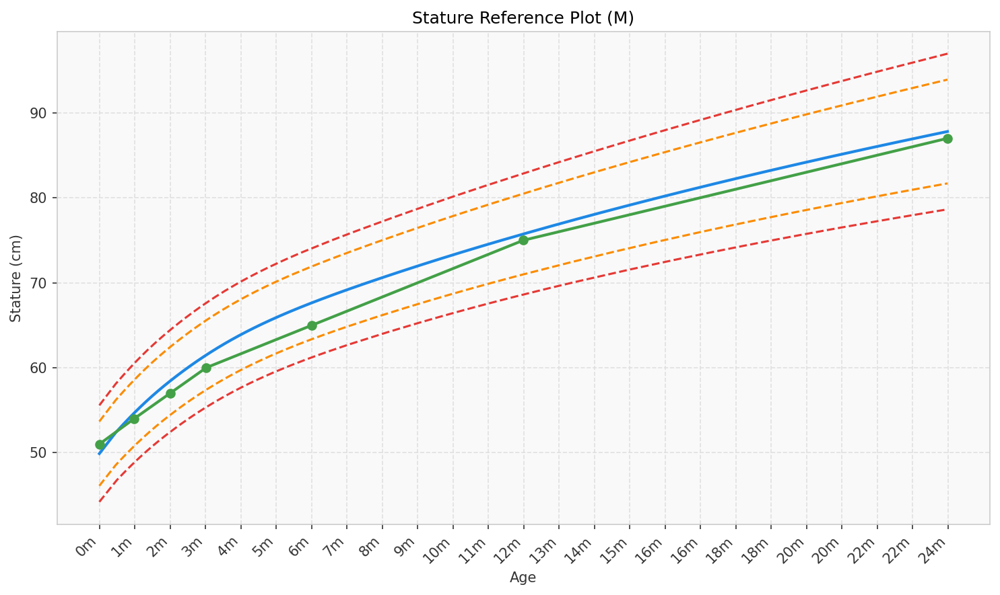
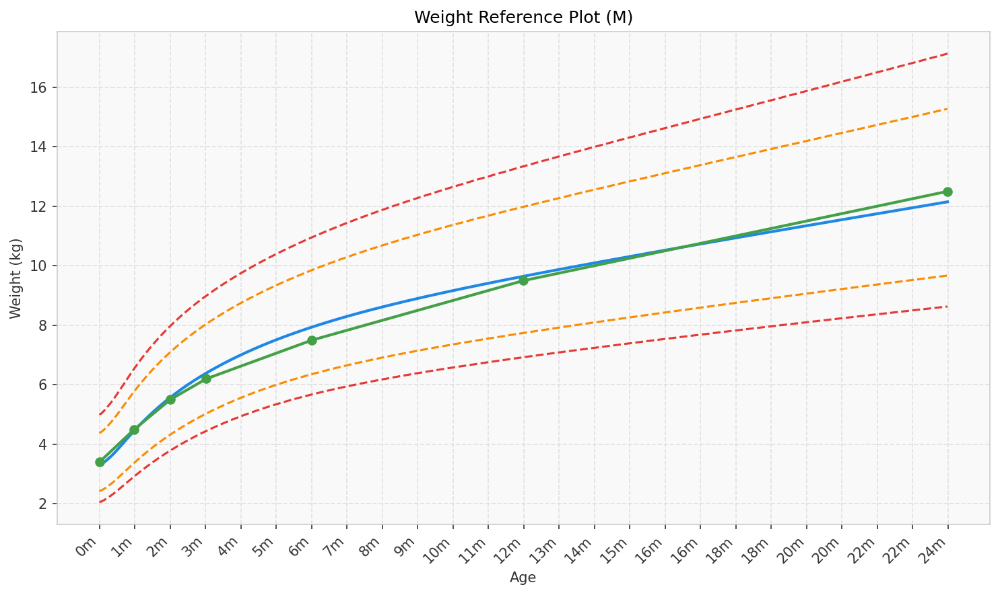
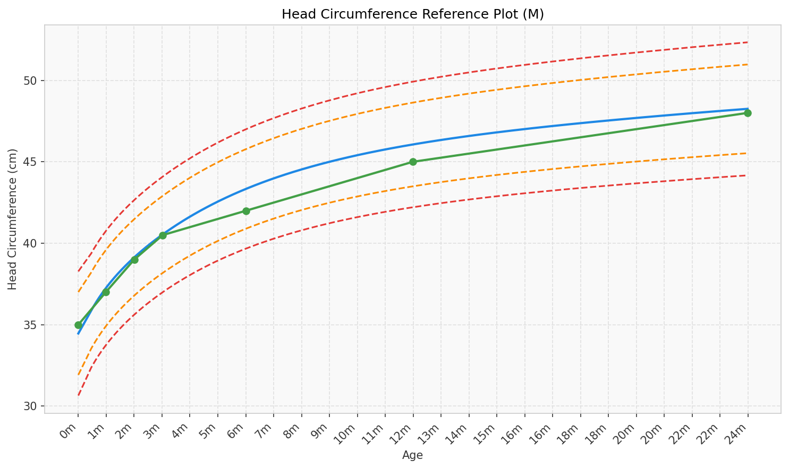
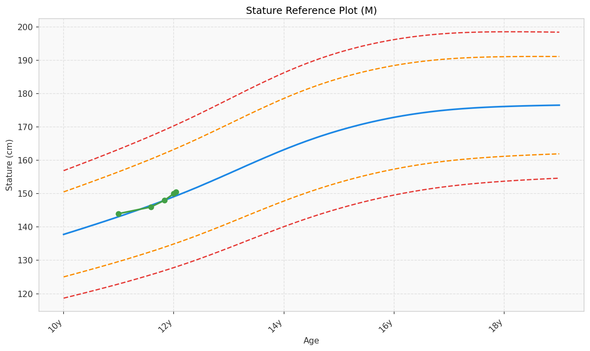
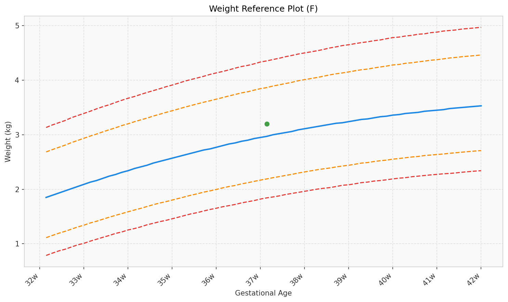
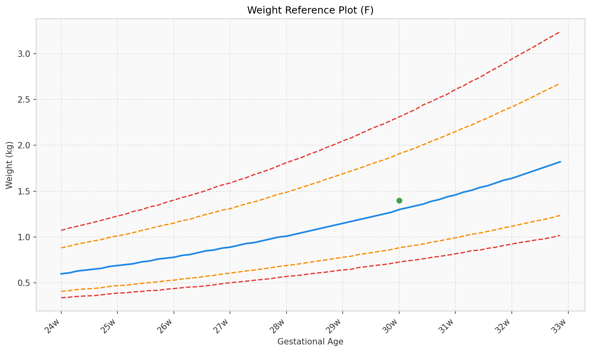

# pygrowthstandards

[](https://badge.fury.io/py/pygrowthstandards)
[](https://pypi.org/project/pygrowthstandards)
[](https://pypi.org/project/pygrowthstandards)
[](https://opensource.org/licenses/MIT)
[](https://github.com/Yannngn/pygrowthstandards/actions/workflows/python-package.yml)
[](https://github.com/pre-commit/pre-commit)

A Python library for calculating and visualizing child growth standards using data from the World Health Organization (WHO) and the INTERGROWTH-21st Project.

This toolkit provides a simple and flexible API to assess child growth by calculating z-scores and percentiles for common anthropometric measurements, including height, weight, BMI, and head circumference.

## Data Sources

This library implements standards from internationally recognized sources:

- **[WHO Child Growth Standards](https://www.who.int/tools/child-growth-standards):** For infants and children from birth to 5 years.
- **[WHO Growth Reference Data for 5-19 years](https://www.who.int/tools/growth-reference-data-for-5to19-years):** For school-aged children and adolescents.
- **[The INTERGROWTH-21st Project](https://intergrowth21.tghn.org/):** For newborn, preterm, and postnatal growth.

## Features

- Calculate z-scores and percentiles for stature (length/height), weight, BMI, and head circumference.
- Support for both WHO and INTERGROWTH-21st growth standards.
- A simple object-oriented `Calculator` for tracking a `Patient`'s measurements over time.
- A straightforward functional API for one-off calculations.
- Generate and save customizable growth charts.

## Results Gallery

Run `make results` to generate demo plots into the `results/` folder.

| Stature (0-2 years) | Weight (0-2 years) |
| --- | --- |
|  |  |

| Head Circumference (0-2 years) | Stature (10-19 years) |
| --- | --- |
|  |  |

| Weight (Newborn) | Weight (Very Preterm Newborn) |
| --- | --- |
|  |  |

## Installation

To install the latest stable release from PyPI:

```bash
pip install pygrowthstandards
```

### Development Installation

To install for development, clone the repository and install in editable mode using uv:

```bash
git clone https://github.com/Yannngn/pygrowthstandards.git
cd pygrowthstandards
uv venv --python 3.11
source .venv/bin/activate
uv sync
```

## Quick Start

### Object-Oriented Approach

The object-oriented API is ideal for tracking a patient's growth over time. It uses a fluent `PatientBuilder` to capture birth data and measurements, plus a `Plotter` to visualize them.

```python
# filepath: main.py
import datetime
from pygrowthstandards.oop.builders import PatientBuilder

builder = (
    PatientBuilder()
    .with_sex("M")
    .born_on(datetime.date(2022, 1, 1))
    .gestational_age(weeks=40, days=0)
)

builder.measured_at("2022-07-01", weight=8.6, stature=68.4, head_circumference=44.5)
builder.measured_at("2023-01-01", weight=10.2, stature=75.7, head_circumference=46.5)
builder.measured_at("2024-01-01", weight=12.6, stature=87.8, head_circumference=48.5)

patient = builder.build_and_calculate()
print(patient.display_measurements())

patient.plot(
    age_group="0-2",
    measurement_type="stature",
    show=False,
    output_path="stature_growth_chart.png"
)
```

#### Example Output

After running the above code, you can view the generated growth chart:


### Functional Approach

For quick, single, stateless calculations, the functional API provides direct access to the z-score calculation engine. This is useful when you don't need to track a patient's history.

```python
# filepath: main.py
from pygrowthstandards import functional as F

z1 = F.zscore("stature", 50, sex="F", age_days=0, gestational_age=280)
z2 = F.zscore("weight", 5, sex="F", age_days=30)
z3 = F.zscore("head_circumference", 40, sex="F", age_days=180)

# Birthdate + measurement date + GA weeks/days
z4 = F.zscore(
    "weight",
    3.2,
    sex="F",
    birth_date="2024-01-01",
    measurement_date="2024-01-15",
    gestational_age_weeks=30,
    gestational_age_days=2,
)

print(f"{z1:.2f}\n{z2:.2f}\n{z3:.2f}\n{z4:.2f}")
```

The output of this script is:

```
0.45
1.34
-1.64
2.33
0.36
-0.94
```

## Future API Enhancements

We're actively researching ways to make PyGrowthStandards even more user-friendly! Check out our [Fluid API Research](FLUID_API_SUMMARY.md) for proposed enhancements including:

- **Method chaining** for 50-60% code reduction
- **Builder patterns** for declarative patient construction
- **Unified facade** for simplified imports and batch processing

All proposed changes maintain 100% backward compatibility. [Read the research](FLUID_API_RESEARCH.md) and share your feedback!

## Contributing

Contributions are welcome! Please feel free to open an issue to report a bug or suggest a feature, or submit a pull request with your improvements.

Before contributing, please set up the development environment and run the pre-commit hooks and tests.

```bash
# Install hooks
pre-commit install

# Run tests
pytest
```

## License

This project is licensed under the MIT License. See the [LICENSE](LICENSE) file for details.

## Acknowledgements

This package is built upon the publicly available data provided by the **World Health Organization (WHO)** and **The INTERGROWTH-21st Project**. We are grateful for their commitment to open data and global health.
